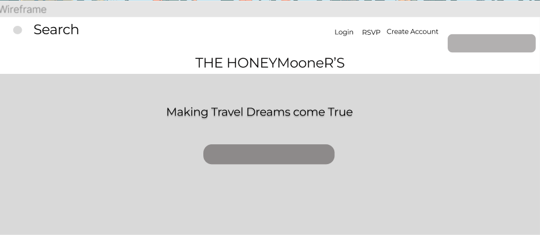

# The MVP

The name of my crowdfunding site is The Honeymooners. The honeymooners is a honeymoon crowdfunding site.

## Purpose

Where newlyweds graciously ask their friends and family to assist in saving for a trip to the their dream destination. 

## Key Features

Features

- Create a user account
- Delete user account and pledge
- RSVP or decline for the wedding
- Ability to pledge money or assistance to the happy couple
- Ability to track the number of pledges and who they came from

API  features

-	Information on all the pledges
-	Information on all the projects
-	Find user information and details on their bio
-	Login URL for all new users to login 
- Create User account

## Database Schema

The database schema features 3 classes that we will be working with the User, the pledges and the projects as seen below.

## Wireframes

Please see below a wire frame of what the The HoneyMooners

## Colour Scheme

Chose color scheme accents of yellow, blue and navy as seen below.

## Heading and body font's

Font: Roboto Mono

Regular 400 at 21px

https://fonts.google.com/specimen/Roboto